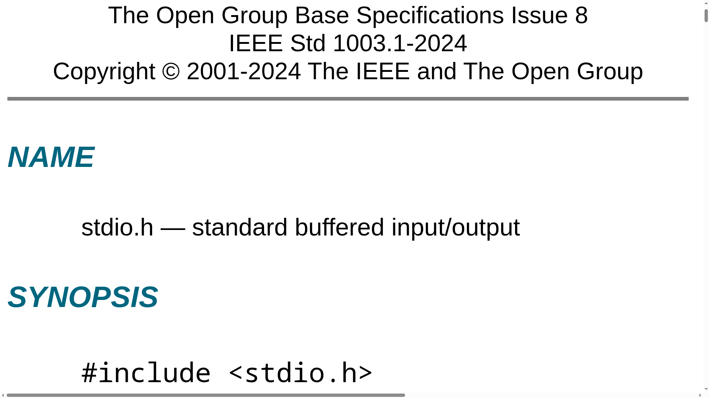
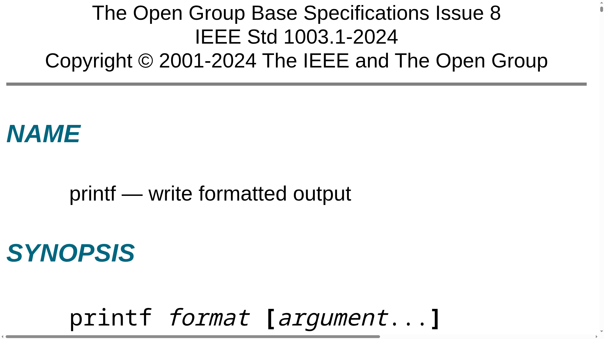
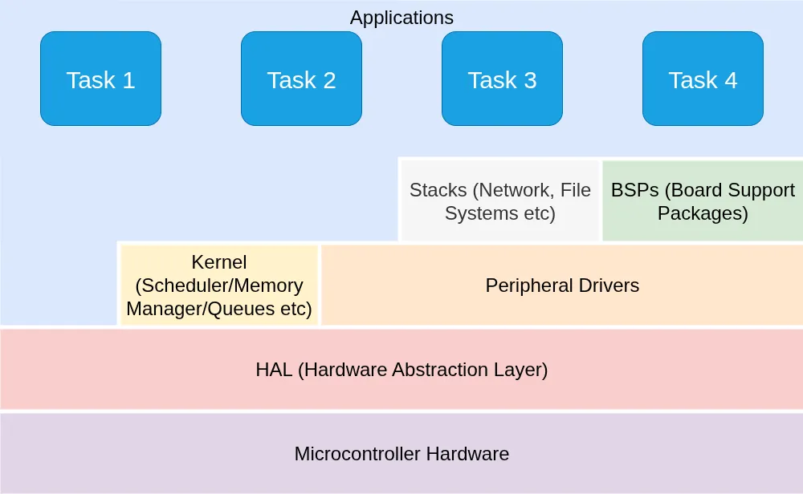
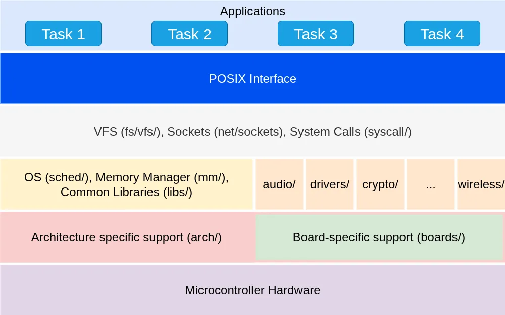
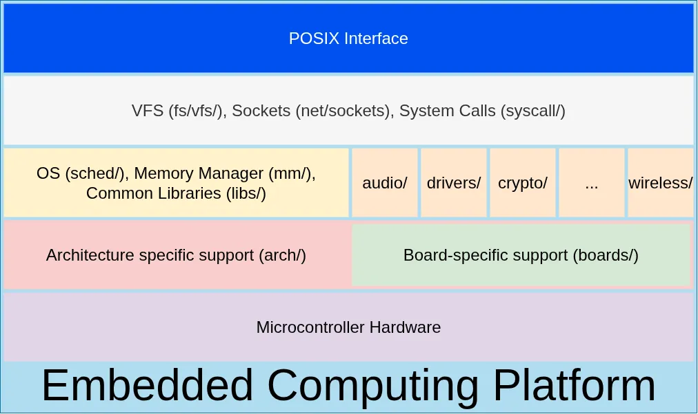
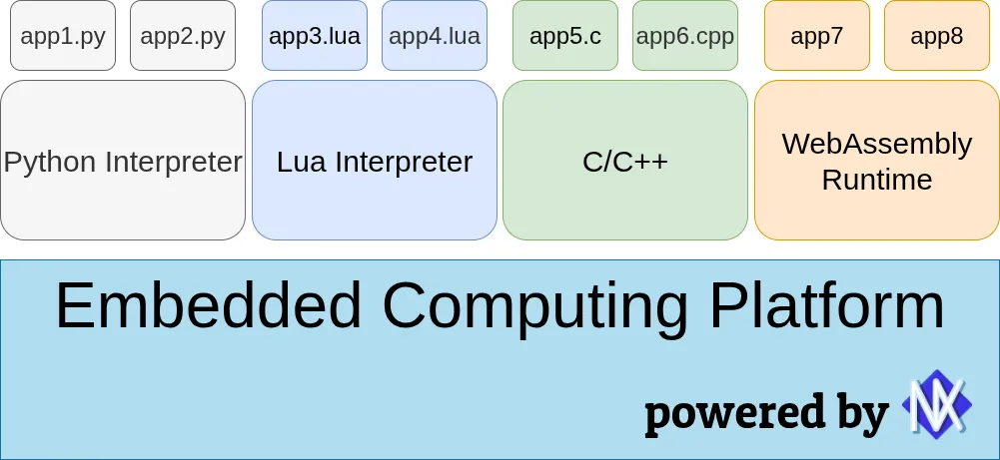
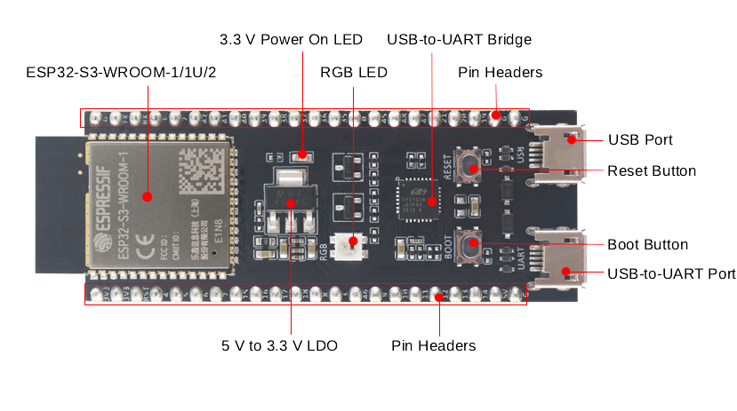

---
# You can also start simply with 'default'
theme: default
# random image from a curated Unsplash collection by Anthony
# like them? see https://unsplash.com/collections/94734566/slidev
# background: https://cover.sli.dev
# favicon, can be a local file path or URL
favicon: '/favicons/favicon-32x32.png'
# force color schema for the slides, can be 'auto', 'light', or 'dark'
colorSchema: light
# aspect ratio for the slides
aspectRatio: 16/9
# real width of the canvas, unit in px
canvasWidth: 980
# some information about your slides (markdown enabled)
title: Python no NuttX
info: |
  Novas Possibilidades para Sistemas Embarcados
# apply unocss classes to the current slide
class: text-center
# https://sli.dev/features/drawing
drawings:
  persist: false
# slide transition: https://sli.dev/guide/animations.html#slide-transitions
transition: slide-left
# enable MDC Syntax: https://sli.dev/features/mdc
mdc: true
# open graph
# seoMeta:
#  ogImage: https://cover.sli.dev
# Config required for slidev-component-poll addon
pollSettings:
  anonymous: true
---

# Python no NuttX

<span style="font-size: 2rem;">Novas Possibilidades para Sistemas Embarcados</span>

<div style="position: absolute; bottom: 2rem; left: 0; width: 100%; text-align: center;">
  Tiago Medicci Serrano<br>
  <span style="font-size: 0.8rem; display: inline-block;">2025-08-05</span>
</div>

<!--
The last comment block of each slide will be treated as slide notes. It will be visible and editable in Presenter Mode along with the slide. [Read more in the docs](https://sli.dev/guide/syntax.html#notes)
-->

---
transition: slide-up
layout: cover
---

# Apache NuttX

## O que é o NuttX? <twemoji-thinking-face/>

<div v-click>

De https://nuttx.apache.org/:

> NuttX is a real-time operating system (**RTOS**) with an emphasis on standards compliance and small footprint. Scalable from 8-bit to 64-bit microcontroller environments, the primary governing standards in NuttX are POSIX and ANSI standards. Additional standard APIs from Unix and other common RTOS’s (such as VxWorks) are adopted for functionality not available under these standards, or for functionality that is not appropriate for deeply-embedded environments (such as `fork()`).

<p align="center">
  
</p>
</div>

<style>
h1 {
  font-family: 'Patua One', cursive;
  color: #3071a9;
}
</style>

<!--
Here is another comment.
-->

---
transition: slide-left
---

## O que é o NuttX? <twemoji-memo/>

<br>

> NuttX is a real-time operating system (**RTOS**).

Tal como outros sistemas operacionais (também RTOSes) conhecidos:

| Sistema Operacional | Licença        | Pulse/Authors[^1] (Jul/2025) |
|---------------------|----------------|------------------------------|
| Zephyr              | Apache 2.0     | 359                          |
| ESP-IDF             | Apache 2.0     | 76                           |
| **NuttX**           | **Apache 2.0** | **59**                       |
| RIOT                | LGPL2.1        | 19                           |

[^1]: *Pulse* é uma referência a repositórios públicos no GitHub. Entre outras informações úteis, o número de autores diferentes pode estar relacionado à atividade do projeto.

---
transition: slide-left
---

## O que é o NuttX? <twemoji-memo/>

> (...) with an emphasis on standards compliance and small footprint. Scalable from 8-bit to 64-bit microcontroller environments (...)

Suporta múltiplas arquiteturas de hardware, de *Z80* à *RISC-V*s de 64 bits e, claro, os seguintes SoCs da Espressif:
 * Xtensa:
   - ESP32
   - ESP32-S2
   - ESP32-S3
 * RISC-V:
   - ESP32-C3
   - ESP32-C6
   - ESP32-H2
   - ESP32-P4 (**Em Breve**)

---
transition: slide-up
---

## O que é o NuttX? <twemoji-memo/>

<br>

> (...) the primary governing standards in NuttX are POSIX and ANSI standards.

<br>

### POSIX?

<br>

<div v-click>

> POSIX (um acrônimo para: Portable Operating System Interface, que pode ser traduzido como Interface Portável entre Sistemas Operativos) é uma família de normas definidas pelo IEEE para a manutenção de compatibilidade entre sistemas operacionais (sistemas operativos em PT-PT), e designada formalmente por IEEE 1003. POSIX define a interface de programação de aplicações (API), juntamente com shells de linha e comando e interfaces utilitárias, para compatibilidade de software com variantes de Unix e outros sistemas operacionais.

De https://pt.wikipedia.org/wiki/POSIX, acessado em 23 de julho de 2025.

</div>

---
transition: slide-left
layout: cover
---

## Sim, POSIX! <twemoji-raising-hands/>

Ainda de https://pt.wikipedia.org/wiki/POSIX, acessado em 23 de julho de 2025:

> Tem como objetivo garantir a portabilidade do código-fonte de um programa a partir de um sistema operacional que atenda às normas POSIX para outro sistema POSIX, desta forma as regras atuam como uma interface entre sistemas operacionais distintos.

---
transition: slide-up
layout: cover
---

### **POSIX:** *O Super Trunfo do NuttX!* <twemoji-oncoming-fist/>

<br>

#### [Reinventing the wheel](https://en.wikipedia.org/wiki/Reinventing_the_wheel) <twemoji-cross-mark/>

Alguém já teve que fazer ~~quase~~ a mesma aplicação que você!

#### [Code reuse](https://en.wikipedia.org/wiki/Code_reuse) <twemoji-check-mark-button/>

Provavelmente, esta aplicação já foi desenvolvida para sistemas operacionais Unix com interfaces POSIX <twemoji-winking-face/>

---
transition: slide-left
layout: statement
---

***O NuttX é o RTOS mais próximo do Linux embarcado para microcontroladores!***

<br>
<br>
<br>
<br>
<br>
<br>

<span style="color: #666666">

e essa afirmação *esconde* uma série de vantagens...

</span>

---
layout: two-cols-header
transition: slide-up
---

### Hello, World!

<span style="color: #666666">

*Quais são as interfaces POSIX?*

</span>

```c {all|2|6|2,6}
#include <nuttx/config.h>
#include <stdio.h>

int main(int argc, FAR char *argv[])
{
  printf("Hello, World!!\n");
  return 0;
}
```

::left::



::right::



---
transition: slide-up
---

### *Hello, World!*, ELF loader, Web-assembly e muito mais...

A apresentação do NuttX no Espressif Summit Brasil 2024 está disponível em:

https://tmedicci.github.io/esb24-nuttx

<iframe src="https://tmedicci.github.io/esb24-nuttx/#27" height="350px" width="100%" frameBorder="0"></iframe>

---
transition: slide-left
layout: center
class: text-center
---

<br>

<div style="color: #666666; position: absolute; top: 3rem; left: 1rem; width: 97%; text-align: left;">

*Ok, o NuttX é compatível com POSIX, o acesso ao hardware é feito através de interfaces conhecidas e aplicações podem ser compiladas externamente e carregadas no firmware, mas...*

</div>

# Por que usar o NuttX?

<br>

<div v-click>

## Plataforma Computacional Embarcada 🧑‍💻

</div>

---
transition: slide-left
class: text-center
---

<br>

### Arquitetura Tradicional de Sistemas Operacionais Embarcados

<p align="center">

</p>

---
transition: slide-left
class: text-center
---

<br>

### e no NuttX...

<p align="center">

</p>

<div v-click>
  <span style="color: #666666">

*E, deixando as aplicações de lado por enquanto...*

  </span>
</div>

---
transition: slide-up
class: text-center
---

<br>
<br>

<p align="center">

</p>

<div v-click>
  <span style="color: #666666">

*Ou, simplificando...*

  </span>
</div>

---
transition: slide-left
class: text-center
---

<br>

<br>
<br>

<p align="center">

</p>

---
transition: slide-up
---

## Novos Conceitos <twemoji-books/>

<br>

### Sistema Embarcado <flat-color-icons-electronics/> *vs* Plataforma Computacional <flat-color-icons-command-line/>:

<br>

<div v-click>

* Interface padrão para acesso ao hardware (POSIX):
  - Reutilização de Código
  - Múltiplas linguagens de programação
  - Controle de acesso aos periféricos controlado pelo sistema operacional

</div>

<div v-click>

* Base para o desenvolvimento de diferentes produtos

</div>

<div v-click>

* Atualização de Sistema *vs* Atualização de Aplicações

</div>

<div v-click>

* **Democratização da Programação Embarcada**:
  - Engenheiro de Sistemas Embarcados: plataforma computacional
  - Desenvolvedores de Software: desenvolvimento de aplicações

</div>

<br>

<div v-click>
  <span style="color: #666666">

*E, finalmente...*

  </span>
</div>

---
transition: slide-left
---

## Python no NuttX <logos-python/>

<br>

<span style="color: #666666">

### *Por que Python?*

</span>

* De [IEEE Spectrum’s 11th annual rankings](https://spectrum.ieee.org/top-programming-languages-2024)[^ieee]:
  - Linguagem mais adotada entre os membros do IEEE
  - O dobro do segundo colocado (Java)
* De [2024 Stack Overflow Developer Survey](https://survey.stackoverflow.co/2024/technology/#1-programming-scripting-and-markup-languages)[^stack-overflow]:
  - Usada por mais de 51% dos desenvolvedores

<br>

<span v-click style="color: #666666">

<twemoji-right-arrow/> *O Python é a linguagem de programação mais usada no mundo, considerando as linguagens não específicas para Web.*

</span>

<br>
<br>

[^ieee]: https://spectrum.ieee.org/top-programming-languages-2024
[^stack-overflow]: https://survey.stackoverflow.co/2024/technology/#1-programming-scripting-and-markup-languages

---
transition: slide-left
---

## Python no NuttX <logos-python/>

<br>

<span style="color: #666666">

### *Por que Python (e não MicroPython)?*

</span>

<br>

#### Footprint

<br>

<div class="text-sm">

| **Aspecto**                | **Python** <twemoji-exclamation-mark/>  | **MicroPython** <twemoji-check-mark-button/> |
|----------------------------|-----------------------------------------|----------------------------------------------|
| Uso de Memória             | MiB                                     | KiB                                          |
| Tamanho                    | Dezenas de MiB                          | < MiB                                        |
| Dependências               | POSIX                                   | Bare-metal/RTOS-dependent                    |

</div>

---
transition: slide-left
---

## Python no NuttX <logos-python/>

<br>

<span style="color: #666666">

### *Por que Python (e não MicroPython)?*

</span>

<br>

#### Gerenciamento de Memória

<br>

<div class="text-sm">

| **Aspecto**                | **Python** <twemoji-check-mark-button/> | **MicroPython**               |
|----------------------------|-----------------------------------------|-------------------------------|
| Garbage Collection         | Automático                              | Manual                        |
| Alocação de Memória        | Dinâmico/Flexível                       | Limitada (requer refinamento) |
| Esforço de Desenvolvimento | Menor                                   | Maior (requer gerenciamento)  |

</div>

---
transition: fade-out
---

## Python no NuttX <logos-python/>

<br>

<span style="color: #666666">

### *Por que Python (e não MicroPython)?*

</span>

<br>

#### Bibliotecas

<br>

| **Aspecto**                | **Python** <twemoji-check-mark-button/> | **MicroPython**                                       |
|----------------------------|-----------------------------------------|-------------------------------------------------------|
| Abrangência                | Python's Standard Library               | Subconjunto (necessário para dispositivos embarcados) |
| Acesso ao Hardware         | Interfaces POSIX (arquivos e sockets)   | Direto                                                |

---
transition: slide-left
layout: cover
class: text-center
---


## Python no NuttX <logos-python/>

<br>

<span style="color: #666666">

### *Por que Python (e não MicroPython)?*

</span>

<br>

<div v-click style="font-size: 4em;">Porque podemos!</div>

---
transition: slide-up
---

## Python no NuttX <logos-python/>

<br>

### ESP32-S3

* Ao menos 8MiB de memória RAM externa (PSRAM)
* Ao menos 16MiB de memória Flash

O Módulo `ESP32-S3-WROOM-2-N32R8V` na placa `ESP32-S3-DevKitC-1`[^esp32s3-board] cumpre estes requisitos da placa, por exemplo.

<p align="center">
  
</p>

[^esp32s3-board]: https://docs.espressif.com/projects/esp-dev-kits/en/latest/esp32s3/esp32-s3-devkitc-1/index.html
---
transition: slide-left
---

De https://developer.espressif.com/blog/2025/03/nuttx-python-esp32s3:

<iframe src="https://developer.espressif.com/blog/2025/03/nuttx-python-esp32s3/#compiling-and-flashing" height="450px" width="100%" frameBorder="0"></iframe>

---
transition: slide-left
---

### Exemplo: LED endereçável da Placa `ESP32-S3-DevKitC-1` <openmoji-led/>

<Asciinema src="casts/ws2812.cast" :playerProps="{speed: 1.2, rows: 18, poster: 'npt:0:7'}"/>

---
transition: slide-left
---

### Exemplo: LED endereçável da Placa `ESP32-S3-DevKitC-1` <openmoji-led/>


Aplicação `ws2812`, em https://github.com/apache/nuttx-apps/blob/master/examples/ws2812/ws2812_main.c:

````md magic-move {lines: true}

```c {*|18|*}
int main(int argc, FAR char *argv[])
{
  FAR uint32_t *buffer;
  FAR uint32_t *bp;
  ssize_t       result;

  if (config.path == NULL)
    {
      config.path = strdup(CONFIG_EXAMPLES_WS2812_DEFAULT_DEV);
    }

  /* Parse the command line */

  parse_args(&config, argc, argv);

  /* Run the display loop */

  int fd = open(config.path, O_WRONLY);

```

```c {1|*}
  int fd = open(config.path, O_WRONLY);
  if (fd < 0)
    {
      fprintf(stderr,
              "ws2812_main: open %s failed: %d\n",
              config.path,
              errno);
      goto errout;
    }

  buffer = calloc(4, config.leds);

  if (buffer == NULL)
    {
      fprintf(stderr, "ws2812_main: buffer allocation failed: %d\n", errno);
      goto errout;
    }

```

```c
  if (buffer == NULL)
    {
      fprintf(stderr, "ws2812_main: buffer allocation failed: %d\n", errno);
      goto errout;
    }

  for (int i = 0; i < config.loops; ++i)
    {
      for (int j = 0; j < 256; ++j)
        {
          bp  = buffer;

          for (int k = 0; k < config.leds; ++k)
            {
              *bp++ = ws2812_gamma_correct(
                          ws2812_hsv_to_rgb((j + k) & 0xff,
                                            0xff,
                                            0xff));
            }

          lseek(fd, 0, SEEK_SET);

```

```c {*|3|*}
          lseek(fd, 0, SEEK_SET);

          result = write(fd, buffer, 4 * config.leds);
          if (result != 4 * config.leds)
            {
              fprintf(stderr,
                      "ws2812_main: write failed: %d  %d\n",
                      result,
                      errno);

              goto errout_with_dev;
            }

          usleep(config.delay);
        }
    }
```

```c

  free(buffer);
  close(fd);
  fflush(stdout);
  return OK;

errout_with_dev:
  close(fd);

errout:
  fflush(stdout);
  return ERROR;
}
```
````

---
transition: slide-up
---

### Exemplo: LED endereçável da Placa `ESP32-S3-DevKitC-1` <openmoji-led/>


<br>

#### Desafio: Como fazer uma aplicação que monitora o uso da CPU e, de acordo com o percentual de tempo ocioso da CPU, acende o LED endereçável em uma escala de verde (totalmente ocioso) para vermelho (totalmente ocupada) em Python? <twemoji-thermometer/>

<br>
<br>

<div v-click style="font-size: 3em;">

Perguntar para o ChatGPT, claro! <twemoji-bullseye/>

</div>

<div v-after>

ou qualquer outra LLM, *pick yours!*

</div>

---
transition: slide-up
---

### Exemplo: LED endereçável da Placa `ESP32-S3-DevKitC-1` <openmoji-led/>


<span style="color: #666666">

Indicando o dispositivo referente ao LED endereçável (`/dev/leds0`), o arquivo que mostra o uso da CPU (`/proc/cpuload`) e o código do programa `ws2812_main.c` como exemplo, a LLM foi capaz de gerar o seguinte arquivo:

</span>

#### `cpumon.py`:

````md magic-move {lines: false}
```py {*|8|*}
import sys
import struct
import select

def main():
    try:
        while True:
            load = get_cpu_load()

            # Calculate RGB values with proper rounding
```

```py {*|3}
def get_cpu_load():
    try:
        with open('/proc/cpuload', 'r') as f:
            content = f.read().strip()
            # Extract numeric value and remove percentage sign
            percent_str = content.replace('%', '').strip()
            load_percent = float(percent_str)
            normalized_load = load_percent / 100.0
            return max(0.0, min(normalized_load, 1.0))
    except IOError as e:
        print(f"Error reading /proc/cpuload: {e}")
        sys.exit(1)
    except ValueError:
        print(f"Invalid data in /proc/cpuload: '{content}'")
        sys.exit(1)
```

```py
            load = get_cpu_load()

            # Calculate RGB values with proper rounding
            r = int(load * 255 + 0.5)
            g = int((1 - load) * 255 + 0.5)
            b = 0

            # Pack as BGR0 (4 bytes) for the LED
            data = struct.pack('4B', b, g, r, 0)

            # Write to device
```

```py {*|3|4|10}
            # Write to device
            try:
                with open('/dev/leds0', 'wb') as f:
                    f.write(data)
            except IOError as e:
                print(f"Error writing to device: {e}")
                sys.exit(1)

            # Wait 100ms using select (instead of time.sleep)
            select.select([], [], [], 0.1)

    except KeyboardInterrupt:
        print("\nExiting...")
        sys.exit(0)

if __name__ == '__main__':
    main()
```
````

---
transition: slide-left
---

### Exemplo: LED endereçável da Placa `ESP32-S3-DevKitC-1` <openmoji-led/>


<br>

<div style="color: #666666; width: 100%; text-align: center; font-size: 2em">

*Ok, mas como enviar e executar este script no NuttX?*

</div>

<br>

<v-clicks depth="1">

* Gravando em um cartão SD
* Gravando em uma partição da Flash
  - Converter o arquivo para um sistema de arquivos suportado (`SPIFFS`, `smartFS`, `FAT`)
  - Mover para o cartão SD/gravar na memória Flash em uma posição conhecida
  - Montar o cartão SD/memória Flash no NuttX
* **Transferir pelo Wi-Fi para uma partição/sistema de arquivos já existente**

</v-clicks>

---
transition: slide-up
---

<video id="myVideo1" width="1280" height="720" controls>
  <source src="./videos/nuttx_python_on_esp32s3.mp4" type="video/mp4">
  Your browser does not support the video tag.
</video>

---
transition: slide-left
---

Interfaces Não Padronizadas <flat-color-icons-lock/>

<div style="color: #666666; width: 100%; font-size: 1em;">

*Ah, mas e se não existir uma interface POSIX, como o script Python interage com o NuttX?*

</div>

<div v-click>

#### O Gerenciador de Conexões de Rede

<br>

</div>

<v-clicks>

* `NetworkManager`
* `ConnMan`
* `WICD`
* `WAPI` (**NuttX**)

</v-clicks>

<br>

<div v-click>

#### A Solução: `import os`

<br>

```py
import os

# Qualquer comando ou aplicação disponível no NuttShell (`nsh > help`) pode ser executado com `os.system`

os.system("wapi --help")
```

</div>

---
transition: slide-up
---

### Exemplo: Conectando-se ao Wi-Fi via `wapi`

<p align="center">

<Asciinema src="casts/wapi.cast" :playerProps="{speed: 2, rows: 25, poster: 'npt:0:7'}"/>

</p>

---
transition: slide-up
---

## Referências

<br>

* Esta apresentação: https://tmedicci.github.io/esb25-nuttx/
* Running Python on ESP32-S3 with NuttX[^devport]
* Apache NuttX: Porting Python to NuttX[^tmedicci]
* NuttX Documentation: `python` interpreter[^nuttx]

<br>

## Onde me encontrar?

<br>

<logos-github-icon/> <logos-linkedin-icon/> @tmedicci

<br>
<br>

## Questões?

[^devport]: https://developer.espressif.com/blog/2025/03/nuttx-python-esp32s3/
[^tmedicci]: https://tmedicci.github.io/articles/2025/01/08/python_on_nuttx.html
[^nuttx]: https://nuttx.apache.org/docs/latest/applications/interpreters/python/index.html
